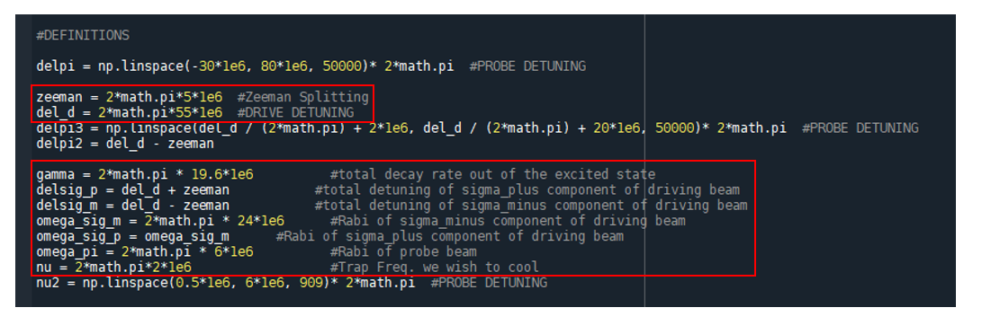
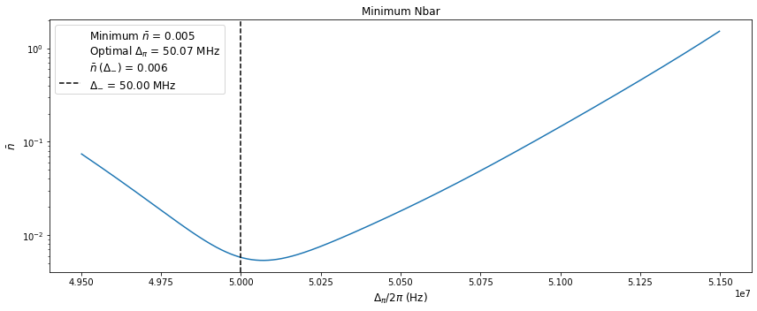
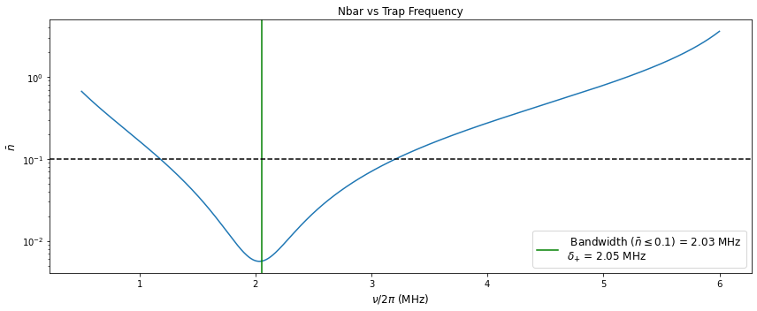

# EIT Cooling 

## Absorption Spectrum

**MAIN SCRIPT - EIT_Functions.py** - *Running this will create 4 plots, given choices of laser parameters*

The performance of quantum operations with trapped ions can be improved by ground state cooling of the atoms vibrational degrees of freedom. Moreover, quantum simulations with both vibrational and fermionic degrees
of freedom naturally demand ground state cooling of vibrational modes. With the size of quantum systems scaling up, it is all the more neccesary to develop an effecient ground state cooling technique for larger numbers of ions and each of the corresponding modes. These modes are associated with the ions oscillations along one particular trap axis. 

EIT cooling provides an alternative to Resolved Sideband Cooling (RSB). It is capable of simultaneously cooling a very wide range of vibrational modes. Utilizing quantum interference in a three level Λ-scheme. This 
is typically refered to as "Single" EIT cooling in the literature. For 171Yb+, the excited state |e⟩ = |F = 0, m=0⟩ in the P₁/₂ manifold is coupled to the three states, |-⟩ = |F = 1, m=-1⟩, |+⟩ = |F = 1, m=1⟩, and |0⟩ = |F = 1, m=0⟩
in the S₁/₂ manifold via a 369nm laser. 

  

This four level system altogether form two Λ-scheme's, each producing Fano-like profiles in the atomic absorbtion spectrum.

  

To create the above absorption spectrum with this code, you need to define some input parameters:

  

The boxes highlighted in red are the parameters that will need to change based on your experimental apparatus!  

Now, we probe (or complete) one of these Λ-scheme's by choice of probe detuning (See Legend in above Plot). In doing so we can zoom into one of these Fano-like absorption peaks (in this case, we have chosen the left peak in the plot above). 

  

The black, dashed line above indicated the position of the CARRIER transistion, which due to the quantum interference of the applied probe/driving beams, results in a null point along the absorption spectrum. The CARRIER transition falls exactly at the detuning we used to create our two-photon resonance condition (i.e Λ-scheme). Red and Blue lines indicate positions of motional sidebands given a trap secular frequency. The Green line, indicates the position of the light shift from the applied dressing beam. The whole goal in implementing EIT cooling is to tailor this light shift for a given trap freq, for which red sideband transitions (RSB) greatly dominates over the blue sideband transitions (BSB). Moreover, the width of the fano-like absorption peak can be tailored such that all normal modes in the direction of the defined trap freq fit within this "cooling" bandwidth. 

## NBAR

EIT cooling will take place after some period of Doppler cooling. After Doppler cooling, the ions are left near or within the Lamb-Dicke regime, which is the regime in which the wavefunction spread of the ions is far less than the wavelength of the applied lasers. When in this regime, motional sideband transitions increase or descrease the vibrational quanta by exactly 1. Furthermore, after doppler cooling the ions have undergone a randomization of energy due to the nature of the photon emission and absorption, which results in the ions taking on a Maxwell-Boltzmann distribution (i.e. thermal distribution). For this reason, calculating the average phonon number of our ions can be done using the ratio method. 

  

With this, we can calculate the expected minimum value of NBAR, as well as an overall cooling bandwidth: 

  

  

## Tailoring AC Lightshift

As mentioned above, the main goal of EIT is to tailor the induced light shift for a given trap freq. The main handles that effect this light shift, is 1.) the overall detuning of the EIT beams from the excited state, and 2.) The power used for the driving beam. 

**POWER SCRIPT - Rabi_RawPower_Relationship.nb** - *This mathematica code computes the relationship between Rabi Freq and raw Laser Power*

The relationship between the light shift and these two main experimental handles can be shown in the plots below: 

**Trap Freq = 3.00 MHz ; Drive Power = 18MHz; Probe Power = 6 MHz; Zeeman = 5 MHz;**

  

