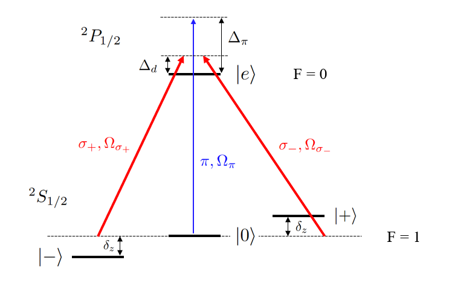
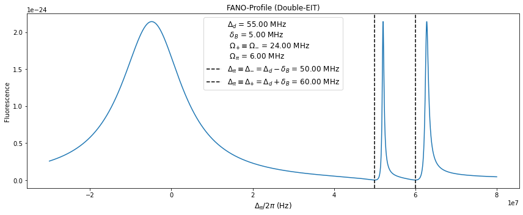
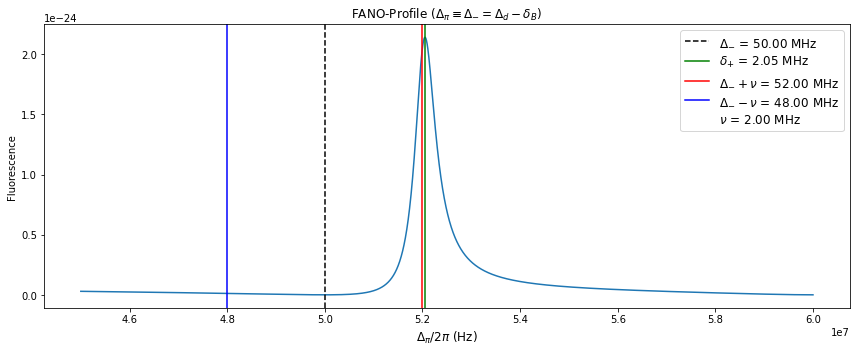

## EIT Cooling 

**MAIN SCRIPT - EIT_Functions.py** - *Running this will create 4 plots, given choices of laser parameters*

The performance of quantum operations with trapped ions can be improved by ground state cooling of the atoms vibrational degrees of freedom. Moreover, quantum simulations with both vibrational and fermionic degrees
of freedom naturally demand ground state cooling of vibrational modes. With the size of quantum systems scaling up, it is all the more neccesary to develop an effecient ground state cooling technique for larger numbers of ions and each of the corresponding modes. These modes are associated with the ions oscillations along one particular trap axis. 

EIT cooling provides an alternative to Resolved Sideband Cooling (RSB). It is capable of simultaneously cooling a very wide range of vibrational modes. Utilizing quantum interference in a three level Λ-scheme. This 
is typically refered to as "Single" EIT cooling in the literature. For 171Yb+, the excited state |e⟩ = |F = 0, m=0⟩ in the P₁/₂ manifold is coupled to the three states, |-⟩ = |F = 1, m=-1⟩, |+⟩ = |F = 1, m=1⟩, and |0⟩ = |F = 1, m=0⟩
in the S₁/₂ manifold via a 369nm laser. 

  

This four level system altogether form two Λ-scheme's, each producing Fano-like profiles in the atomic absorbtion spectrum.

  

Now, we probe (or complete) one of these Λ-scheme's by choice of probe detuning (See Legend in above Plot). In doing so we can zoom into one of these Fano-like absorption peaks (in this case, we have chosen the left peak in the plot above). 

  

The black, dashed line above indicated the position of the CARRIER transistion, which due to the quantum interference of the applied probe/driving beams, is exactly 0. The CARRIER transition falls exactly at the detuning we used to create our two-photon resonance condition (i.e Λ-scheme). Red and Blue lines indicate positions of motional sidebands given a trap secular frequency. The Green line, indicates the position of the absorbtion peak which in other words, is the position of the light shift from the applied dressing beam. 

